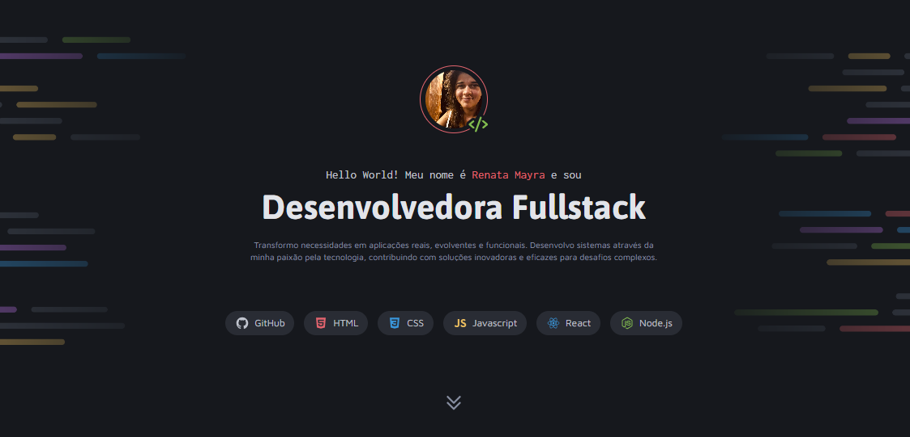

<h1 align="center"> Portfólio Dev </h1>

Site de Portfólio para Desenvolvedora Fullstack, criado para apresentar os projetos, serviços e formas de contato.  

  <a href="#-tecnologias">Tecnologias</a>&nbsp;&nbsp;&nbsp;|&nbsp;&nbsp;&nbsp;
  <a href="#-projeto">Projeto</a>&nbsp;&nbsp;&nbsp;|&nbsp;&nbsp;&nbsp;
  <a href="#-layout">Layout</a>&nbsp;&nbsp;&nbsp;|&nbsp;&nbsp;&nbsp;
  <a href="#memo-licença">Licença</a>

  

 

  

## 🚀 Tecnologias

Esse projeto foi desenvolvido com as seguintes tecnologias:

- HTML
- CSS
- JavaScript
- Git e Github
- Figma

## 💻 Projeto

O **Portfólio Dev** foi criado para apresentar minha trajetória como desenvolvedora, reunindo:

- Habilidades técnicas
- Projetos em destaque
- Serviços
- Formas de contato e redes sociais

👉 [Acesse o portfólio online](https://renatamayra.github.io/portfolio-dev/)

## 🔖 Layout

O layout foi inspirado em um design do Figma.

---

Feito com ♥ por Renata Mayra 🚀
