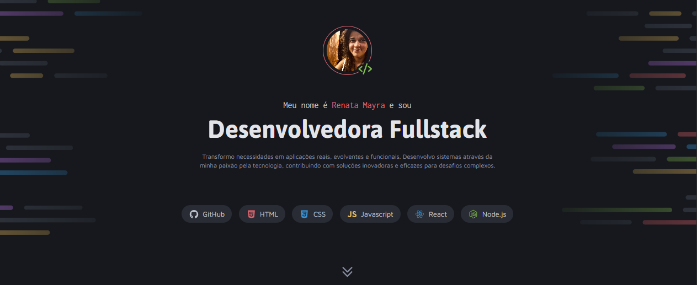

<h1 align="center">💻 Portfólio Dev – Renata Mayra</h1>

Aplicação web desenvolvida para apresentar minha trajetória como <strong>Desenvolvedora Fullstack</strong>, reunindo meus projetos, habilidades e serviços em um único lugar.  

  <a href="#-tecnologias">Tecnologias</a>&nbsp;&nbsp;&nbsp;|&nbsp;&nbsp;&nbsp;
  <a href="#-projeto">Sobre o Projeto</a>&nbsp;&nbsp;&nbsp;|&nbsp;&nbsp;&nbsp;
  <a href="#-layout">Layout</a>&nbsp;&nbsp;&nbsp;|&nbsp;&nbsp;&nbsp;
  <a href="#memo-licença">Licença</a>

  

---

## 🚀 Tecnologias

O projeto foi desenvolvido com as seguintes tecnologias:

- **HTML5** – estrutura semântica e acessível  
- **CSS3** – estilização responsiva e animações sutis  
- **JavaScript** – interatividade e dinamismo  
- **Git & GitHub** – versionamento e deploy  
- **Figma** – prototipagem e referência de design  

---

## 💻 Sobre o Projeto

O **Portfólio Dev** foi criado com o objetivo de transmitir minha identidade profissional e facilitar a conexão com recrutadores e parceiros.  
Nele você encontrará:

- ✨ **Apresentação pessoal** – um pouco sobre quem sou  
- 🛠️ **Habilidades técnicas** – stack de tecnologias que domino  
- 📂 **Projetos em destaque** – cases reais desenvolvidos por mim  
- 📞 **Contato direto** – links para redes sociais e formas de contratação  

👉 [Clique aqui para acessar o portfólio online](https://renatamayra.github.io/portfolio-dev/)  

---

## 🔖 Layout

O design foi inspirado em um protótipo do **Figma**, adaptado e personalizado para refletir minha identidade como desenvolvedora.  
O foco principal foi criar uma **experiência moderna, clara e responsiva**, que se adapta bem a diferentes dispositivos.

---

## :memo: Licença

Esse projeto está sob a licença MIT.  
Sinta-se à vontade para usá-lo como referência em seus estudos ou projetos.  

---

Feito com ♥ por **Renata Mayra** 🚀  
